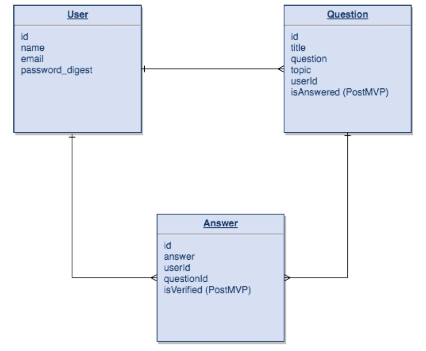
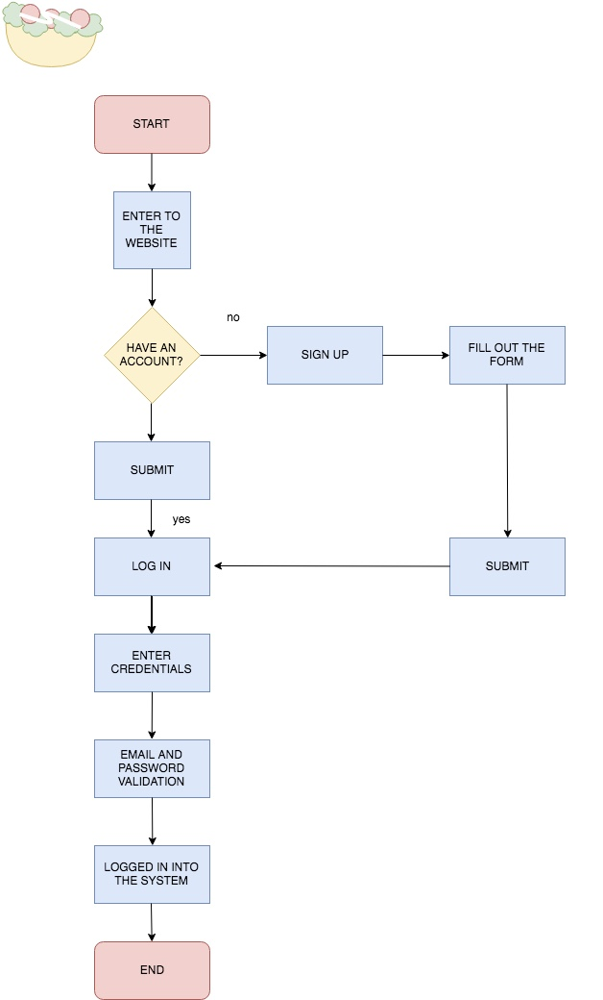
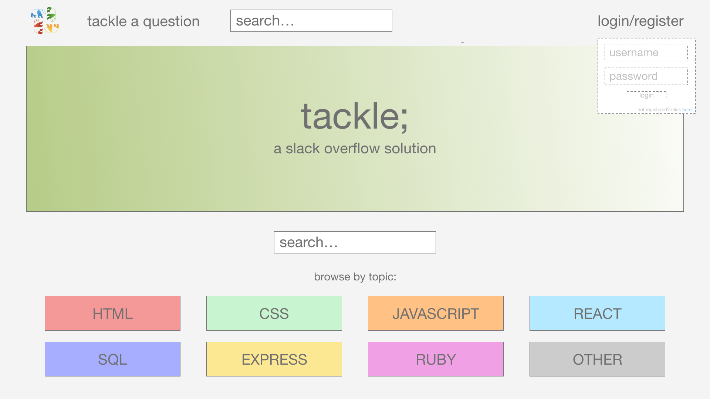
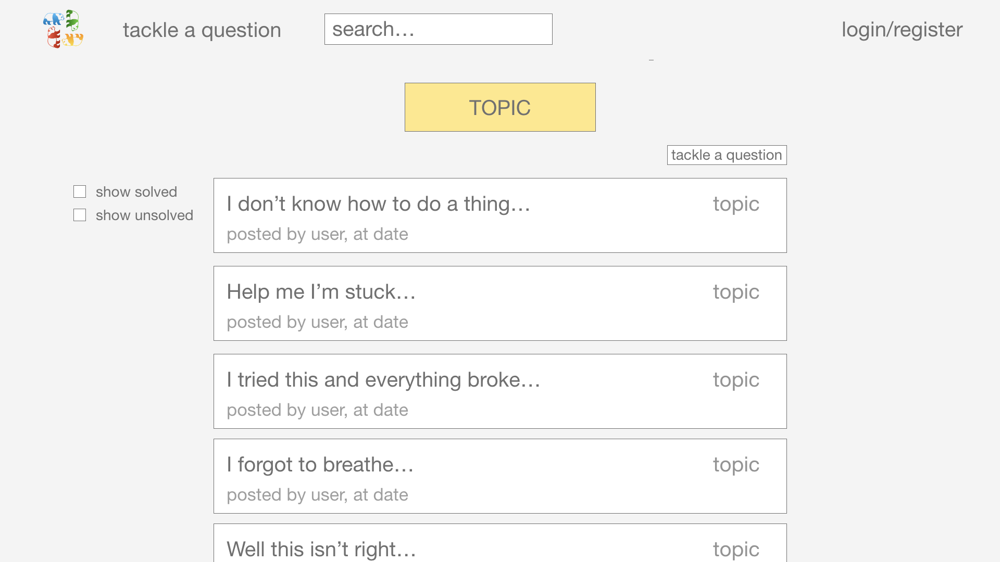
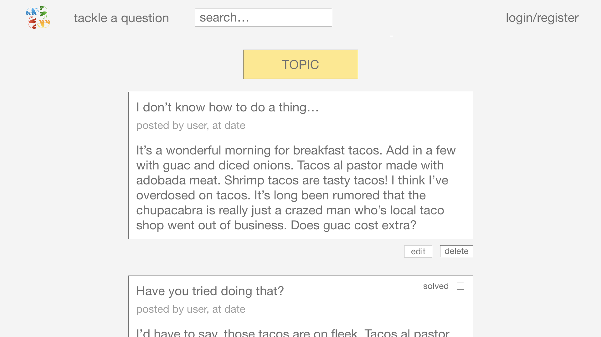
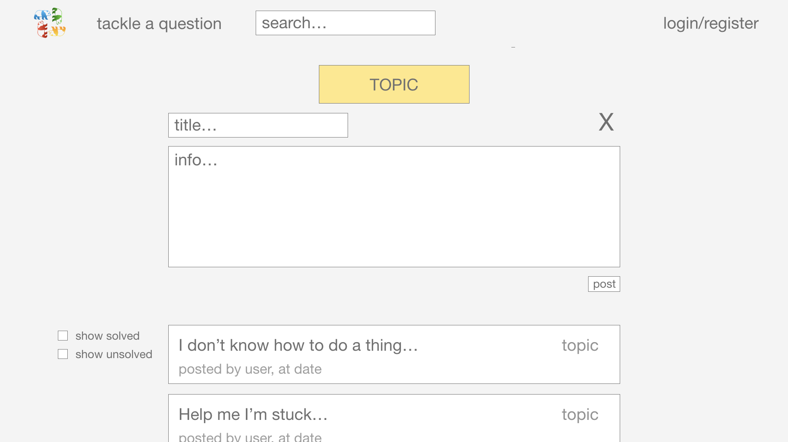
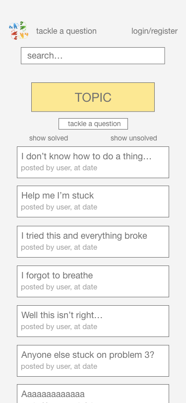
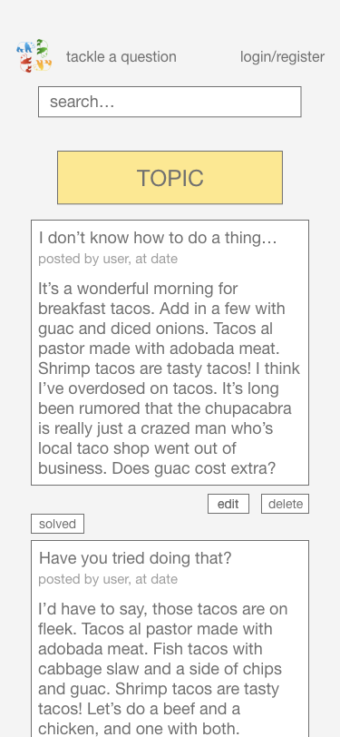
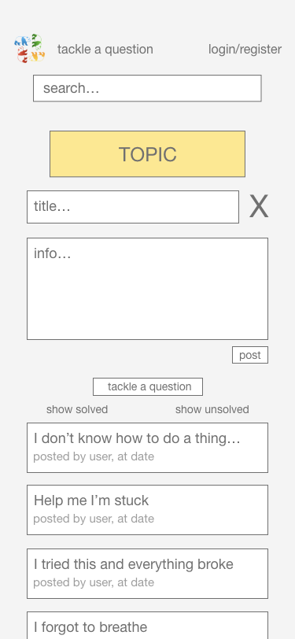

# Project Overview

This is the NYC General Assembly Software Engineerning Immersive, Panda Cohort's "Project 3," created by Francine Altman, Alex Curtin, Erinn Nelson and Ana Silvia, collectively known as "Team Taco".

## Project Description

The purpose of this app is to allow users to ask and answer questions related to coding. Users may post questions and responses by topic once they have created an account. Additionally, questions can be marked as 'solved' by the original poster to help guide other users.

### Set Up
* Fork and clone this repo
* cd into the app directory
* run `npm i`
* run `npm start` to initialize the backend server
* cd into the client directory
* run `npm start` and allow the client server to run on an available port

_Site link not yet available_

Created with [React](https://reactjs.org/), [Express](https://expressjs.com/), and [PostgreSQL](https://www.postgresql.org/)

## MVP

### MVP
* Users can browse questions by topic
* Users can register an account and log in
* Registered users can post/delete/edit questions
* Registered users can post/delete/edit responses to questions

### PostMVP
* Users may mark questions they have posted as 'solved'
* Posted questions can be viewed by 'all,' 'solved only,' or 'unsolved only.'
* Users may search for questions using title or body keywords
* User can visit a profile page that displays their activity on the site
* Users can add a username, edit and delete their account
* Users can login using authentication from 3rd party services like facebook

### App Features
* Users can register an account on the site
* Users and topics are stored on a backend server/database
* Seemless UI

## ERD

 

## API Endpoint Documentation

| **GET** |  |
| --- | --- |
| _/users/verify_ | Primarily used to check if a user is already logged in when the page loads. Takes user’s token from local storage (if there is one) and uses it to verify who they are. |
| _/questions/topic/:topic_ | For fetching all questions pertaining to a specific topic. ‘Topic’ is the only parameter in the request. |
| _/questions/id/:id_ | For fetching one question and all of its associated answers. The request will include the question id. |
| _/question/id/response_ |  |

| **POST** |  |
| --- | --- |
| _/users_ | For adding a new user. Takes users name, email and password, encrypts the password and stores the info in the database. |
| _/users/login_ | For logging in users. Will take their name and password, verify them and create a token to be stored in local storage. |
| _/questions_ | For posting a new question to the database. Requests will include the user’s token, topic, title, question and user id. |
| _/question/id/:id/answers_ | For posting a new answer to a specific question in the database. Takes the user’s token, question id, user id, and answer. |

### PUT

| **PUT** |  |
| --- | --- |
| _/questions/:id_ | For updating a question. The request will include the user’s token, question id, topic, title, and question. |
| _/answers/:id_ | For updating a question. The request will include the user’s token, answer id, and answer. |

| **DELETE** |  |
| --- | --- |
| _/questions/:id_ | For deleting a question. The request will include the user’s token and question id. |
| _/answers/:id_ | For deleting an answer. The request will include the user’s token and answer id. |

## Wireframes

### Desktop

### Mobile

   

## React Component Hierarchy

* **\<App />**
    * \<header>
      * \<nav>
        * \<RouterLink to='/'>
        * **\<SearchBar />**
        * \<HashLink to='/topic-selectors>
        * \<modal name='Login-Register'>
          * **\<UserAccounts />**
            * **\<UserLogin />** _- conditionally render_
              * \<input type='text' name='username'/>
              * \<input type='text' name='password'/>
              * \<button onClick='login user'>
              * \<button onClick='show UserRegister'>
            * **\<UserRegister />** _- conditionally render_
              * \<input type='text' name='name'/>
              * \<input type='text' name='username'/>
              * \<input type='text' name='email'/>
              * \<input type='text' name='password'/>
              * \<button onClick='register user'>
              * \<button onClick='show UserLogin'>
    * \<main>
      * **\<Hero Page />** _- conditionally render_
        * \
        * **\<SearchBar />**
        * **\<TopicSelector />** _- multiple listed_
          * 'title'
          * \<RouterLink to='TopicPage'>
        * \<button onClick='create new question'>
      * **\<TopicOrSearchPage />** _- conditionally render_
        * 'topic/search-query'
        * \<button onClick='create new question'>
        * **\<PostNewQuestion />** _- conditionally render_
          * \<input type='select' name='topic'>
          * **\<PostEditForm />**
            * \<input type='text' name='title'>
            * \<input type='text' name='new-answer'>
        * **\<QuestionsList />**
          * \<button onClick='shows unsolved only'>
          * \<button onClick='shows solved only'>
          * **\<QuestionSelector />** _- multiple listed_
            * 'question title'
            * 'poster username, time posted'
            * 'topic'
            * \<RouterLink to='QuestionPage'>
      * **\<QuestionPage />** _- conditionally render_
        * **\<Question />**
          * **\<UserPost />** _- conditionally render_
            * 'poster username, time posted'
            * 'Answer text and code'
            * \<button onClick='edit'> _- Available to post creator_
            * \<button onClick='delete'> _- Available to post creator_
          * **\<PostEditForm />** _- conditionally render_
            * \<input type='text' name='title'>
            * \<input type='text' name='new-answer'>
            * \<input type='code' name='code'>
        * \<button onClick='create new answer'>
        * **\<PostNewAnswer />** _- conditionally render_
          * **\<PostEditForm />**
            * \<input type='text' name='title'>
            * \<input type='text' name='new-answer'>
            * \<button onClick='submit'>
        * **\<Answer />** - multiple listed
          * **\<UserPost />** _- conditionally render_
            * 'poster username, time posted'
            * 'Answer text and code'
            * \<button onClick='edit'> _- Available to post creator_
            * \<button onClick='delete'> _- Available to post creator_
          * **\<PostEditForm />** _- conditionally render_
            * \<input type='text' name='title'>
            * \<input type='text' name='new-answer'>
          * \<button onClick='marks AnswerPost as correct'> _- Available to QuestionPost creator_
    * \<footer>
      * 'year'
      * \<a href='github'>

## Additional Libraries

* [Axios](https://www.npmjs.com/package/axios)
* [Express](https://www.npmjs.com/package/express)
* [PostgreSQL](https://www.npmjs.com/package/pg)
* [Sequelize](https://www.npmjs.com/package/sequelize)
* [CORS](https://www.npmjs.com/package/cors)
* [Nodemon](https://www.npmjs.com/package/nodemon)
* [Body Parser](https://www.npmjs.com/package/body-parser)
* [Morgan](https://www.npmjs.com/package/morgan)
* [JSON Web Tokon](https://www.npmjs.com/package/jsonwebtoken)
* [BCrypt](https://www.npmjs.com/package/bcrypt)
* [React Router](https://www.npmjs.com/package/react-router)
* [React Router Hash Link](https://www.npmjs.com/package/react-router-hash-link)
* [React Modal](https://www.npmjs.com/package/react-modal)

## Issues and Resolutions

**Potential Problem:** Searching

**Proposed Solution:** Use PostGreSQL select parameter 'LIKE'

**Potential Problem:** Users forgetting passwords

**Proposed Solution:** Create temporary token that allows user to create new password

